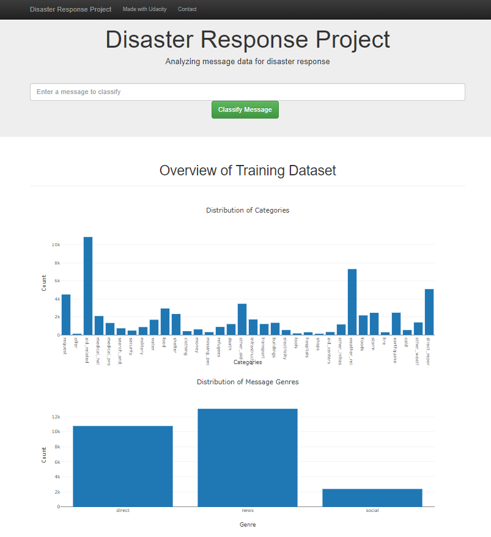
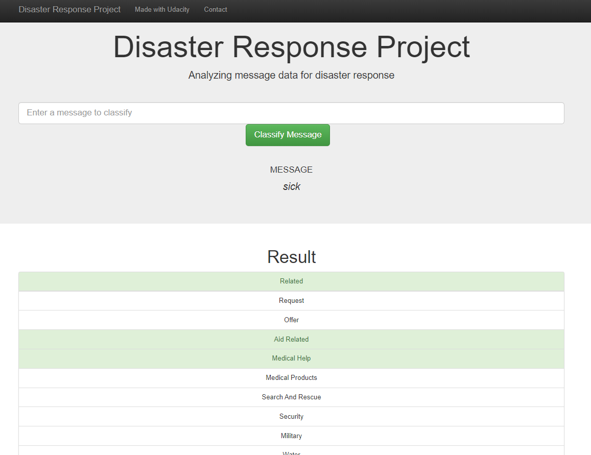

# Disaster Response Pipeline Project

## Table of Contents
* Libraries
* Project Motivation
* File Descriptions
* Instructions for runnig the python scrips
* Licensing, Authors, and Acknowledgements

## Libraries
The libraries used in this repository are:
* pandas
* numpy
* matplotlib
* nltk
* sklearn
* sqlalchemy
* pickle
* re

## Project Motivation
Responding immediatetely in an emergency situation is vital. During disasters, first reponders may gel millions of messages. Classifying messages helps responders act quickly and efficiently.
The purpose of this project is to create a web app that can classify the emergency messages. Data set consists of emergency messages and their classifications caming from Figure Eight. 
In the scope of this project I trained a machine learning model which classifies the emergency messages. By using this trined model, I created a web app that classifies new messages and gives the most related classification in return.

### Understanding the data
There are two data sets: 
* categories: Categories data set includes category names and a number(0 or 1) indicationg whether the message drops in that category or not. There are more then 30 categories and one message can be classified on more than one category.
* messages: Messages data set includes ids, messages and genres of each message. 

### Method
There are four main components of this project:

* ETL pipelines: The first thing to do before any analysis is to get the data and clean it. This step includes loading data, clening the data and importing the data as an sql table. The related code is in process_data.py file in data folder.

* NLP: In order to be able to use a text data in a meachine learning pipeline, we need to process the text. NLP is one of the most popular way to process text data. In this part I have done text processing and feature extraction. You can find the codes related to text processing in train_classifier.py file

* Machine Learning pipelines: This pipeline first loads the clean thada from sql data base. Then split it into test and train data sets. Trains the data by using train data set and evaluates the model according to test data set. There are different types of classifier that can be used in order to make multiple output classification. I have tried couple of models and at the end I used LinearSVM as this is the one that produced the largest f1 score.

* Classifier app: This app uses the model created in ML pipeline step to classify the new messages. It also provides descriptives about the training data set.

## File Descriptions
There are three folders and one data base in this repository:
* app folder: includes the codes for creating a web app that shows classification of new messages
* data folder: includes data files and data preprocessing codes
* models folder: includes model training codes and model pickle file
* DisasterResponse data base: Includes clean data.

## Instructions for runnig the python scrips
In order to be able to run this app in your local computer you need to:
1. Run the following commands in the project's root directory to set up your database and model.

    - To run ETL pipeline that cleans data and stores in database
        `python data/process_data.py data/disaster_messages.csv data/disaster_categories.csv data/DisasterResponse.db`
    - To run ML pipeline that trains classifier and saves
        `python models/train_classifier.py data/DisasterResponse.db models/classifier.pkl`

2. Run the following command in the app's directory to run your web app.
    `python run.py`

3. Go to http://0.0.0.0:3001/

## The screenshots of web app

## Licensing, Authors, and Acknowledgements
This repository is part of Udacity Data Science Nano degree program projects

